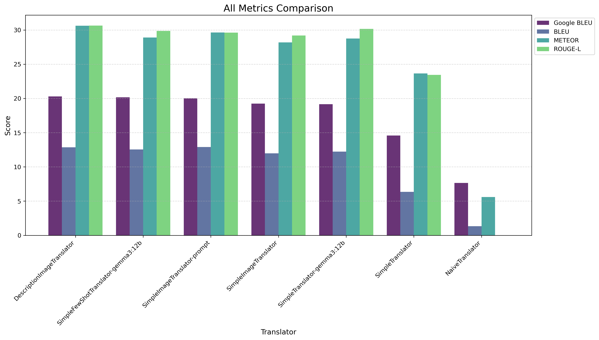
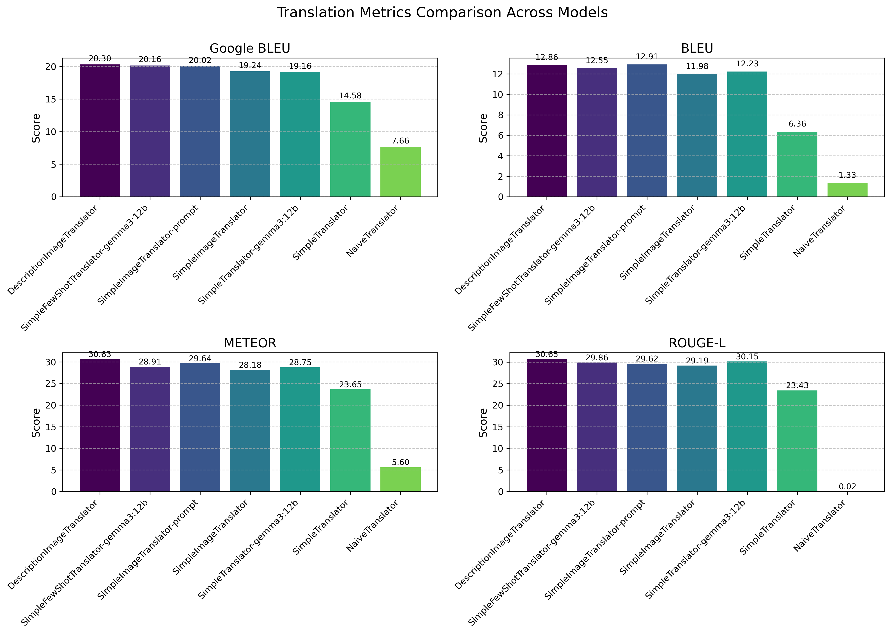
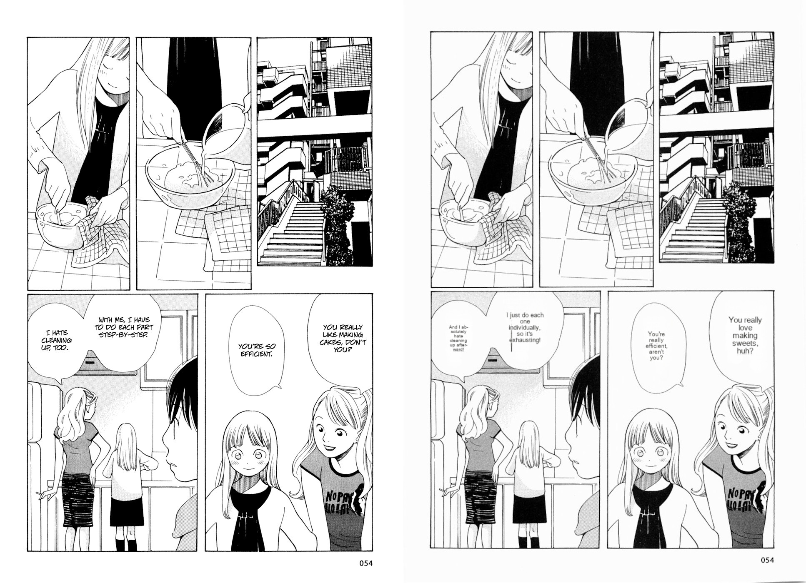
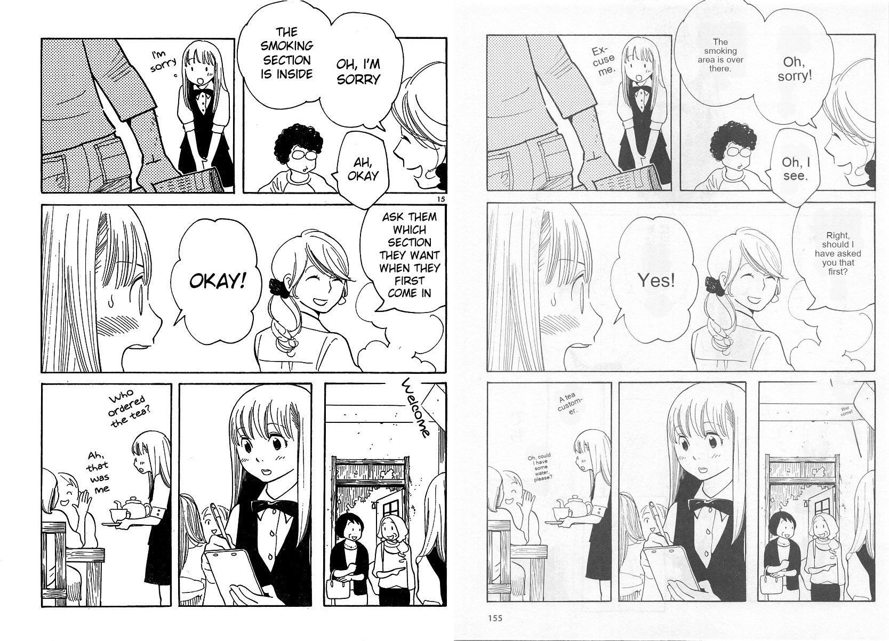
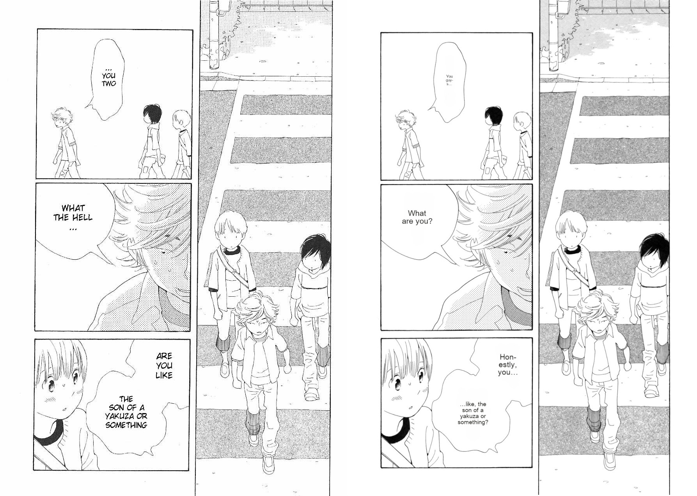
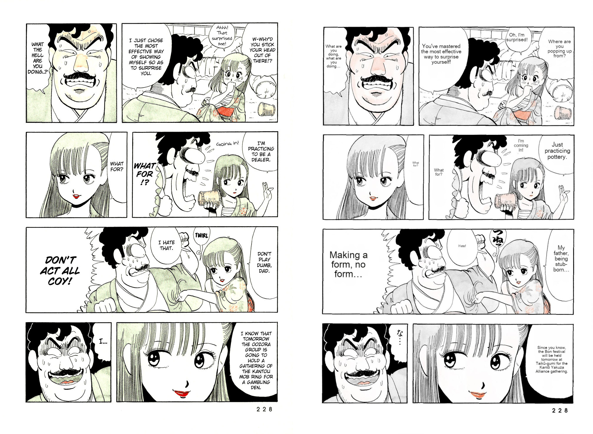
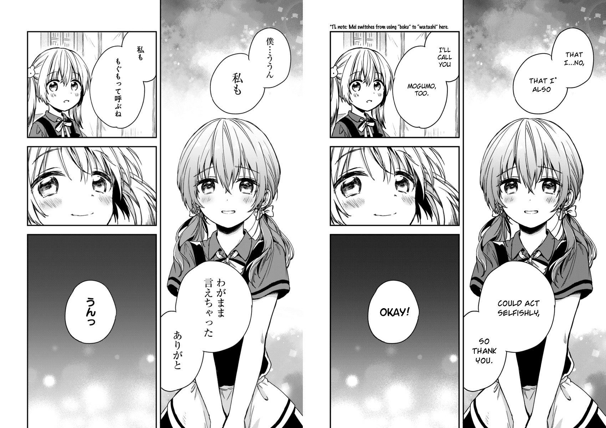
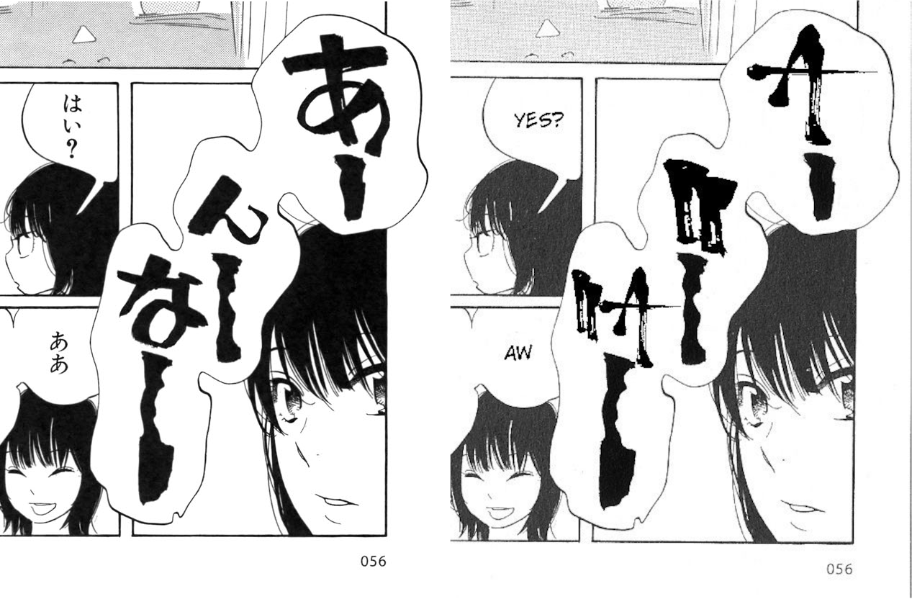

# Prompt engineering manga translation

## Adatok

Feladat azonosítója: Saját téma (38)

Feladat címe: képregény fordító alkalmazás VLM-mel

Beadó neve: \[redacted\]

## Megjegyzés

Ez a megoldás jelentős mértékben hagyatkozik azokra a megállapításokra, amit [Lippmann et al.](https://arxiv.org/pdf/2411.02589) bemutat, viszont forráskódot nem kölcsönöz.

## Megoldás

Ez a házi feladat képregények automatizált fordításával foglalkozik, amihez megpróbáltam kihasználni új vizuális képességekkel rendelkező nagy nyelvi modellek (VLM) képességeit. Az elsődleges fókusz az volt, hogy az egyes oldalak fordítása során, hogyan lehet hatékonyan továbbvinni (görgetni) a kontextust.

A megfelelő módszer megtalálásához egy egyszerű benchmark környezetet is összeállítottam, ami egy japán képregényekből (manga) álló korpuszon kiértékeli a fordítási módszert. A korpusz az [open mantra dataset](https://github.com/mantra-inc/open-mantra-dataset) volt, amit [Hinami et al., 2021](https://arxiv.org/abs/2012.14271) mutatott be és ami a mangák eredeti japán szövege mellett oldalanként tartalmazza azok angol fordítását. A kiértékeléshez figyelembe vettem a fordítás bleu pontszáma mellett a (javított) google bleu, rouge és az összetettebb meteor értékeket is.

Miután végeztem a fordítások kiértékelésével, implementáltam azokat a [manga-image-translator](https://github.com/zyddnys/manga-image-translator) projekt-hez, ami egy klasszikus OCR alapú teljesen automatizált manga fordítást valósít meg. Az eddigi kísérleteim alapján a nyílt súlyú VLM-ek nem képesek elég pontos bounding box-okat megadni szöveg felismeréskor, ezért fontos, hogy az eredeti detekció klasszikus módszerekkel történjen. Habár a projekt támogatja nagy nyelvi modellek (LLM) használatát a fordítási lépéshez, az a korábbi lapok kontextusa és vizuális jellegek figyelembe vétele nélkül történik, ezért az én módszerem javít a pontosságon.

## Érdekes tanulságok

- A legbizotsabb módja a fordításnak, ha az oldal összes szövegét megadjuk kontextusnak, de utána a fordítást soronként kérjük egy chat-ben. Amikor egyben kértem a fordítást, elveszett a sorokban.
- Az események összefoglalása sokat segít amikor a történetet több oldalon keresztül meg szeretnénk tartani. Ezt úgy hatékony megtenni, hogy az elsől végén megkérem, foglalja össze röviden a történetet, ezt az összefoglalót továbbviszem, majd innentől minden oldal végén megkérem, hogy frissítse az összefoglalót.
- Képi jellegek teljes kihasználásához nem elég csak megadni a képet, sokat segít, ha megkérem, hogy szövegesen írja le, amit képen lát.
- Ezek a módszerek jól stack-elődnek, a legjobb modellt ezeknek a kombinációja adja.
- Gondolkozás nem segít a fordításban. A deepseek r1 disztillásával kapott "gondolkozó" modellek nem teljesítettek jól.*

*Ez nem kizárt, hogy az ollama futtató környezet alapértlmezetten alacsony context length-je miatt történt. (Igen erre utólag jöttem rá, nem volt időm újratesztelni javított beállításokkal.)

## Promptok & Eredmények

Forráskód [ebben a repo-ban](https://github.com/boapps/prompt-engineering-manga).

Módosított manga-image-translator forráskódja: [itt](https://github.com/boapps/manga-image-translator)

Felhasznált promptok:

```python
system_prompt="You are a professional manga translator and image captioner."
prefix_prompt="Your job is to translate the following text to English. I will show you the full text beforehand, but we will translate it line by line. You will have to reply only with the translated line.\nJapanese manga text:\n"
image_prompt="First just give a short (1-2 paragraph) description of only the visual scene. Focus on the characters and the background. Don't write anything else."
new_summary_prompt="Now give a short (1-2 paragraph) but precise summary of the story so far based on the image and text."
summary_prompt = (
            ("Summary of the story so far:\n" + self.summary + "\n") if self.summary else ""
)
prompt = f"{summary_prompt}{self.prefix_prompt}{numbered_text}\nAre you ready?"
```

Kiértékelési eredmények:





### Példák

A bal oldali kép a professzionális fordítás és a jobb oldali az automatizált. A mangákat fentről lefele, balról jobbra kell olvasni.

A példák fordításához a Gemma 3 12B modellt használtam lokális környezetben.

### Hourou Musuko







### Stop!! Hibari-kun!



## Limitációk

A fordítás pontosságán kívül vannak limitációi ennek a fajta automatizált fordításnak, amik a folyamat jellegéből adódnak. 

Fordításkor bizonyos finom nyelvi jellegzetességek elveszhetnek, ezeket professzionális fordító a panelek körül egy kis megjegyzésben jelezheti. Ennek automatizálása bonyolult lenne. 



Forrás: Fukakai na Boku no Subete o

Egy igazán jó fordítás a tipográfiai játékot is át tudja hozni. Automatizáláskor viszont csak az eredeti boundingboxba próbáljuk beleszuszakolni a fordított szöveget.



Forrás: Hourou Musuko

